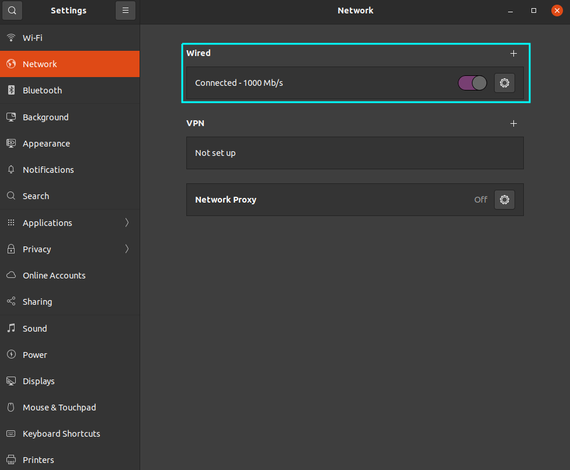
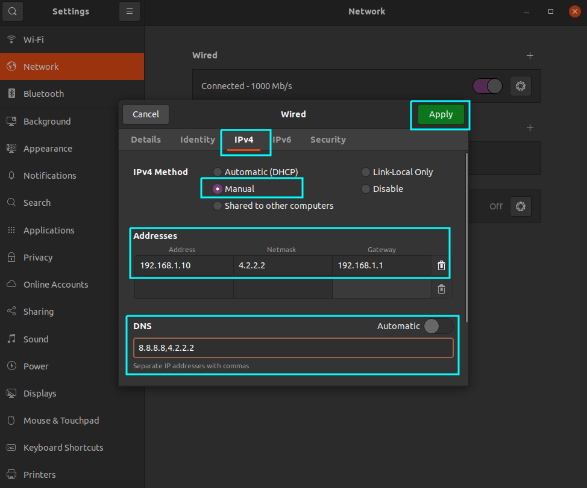
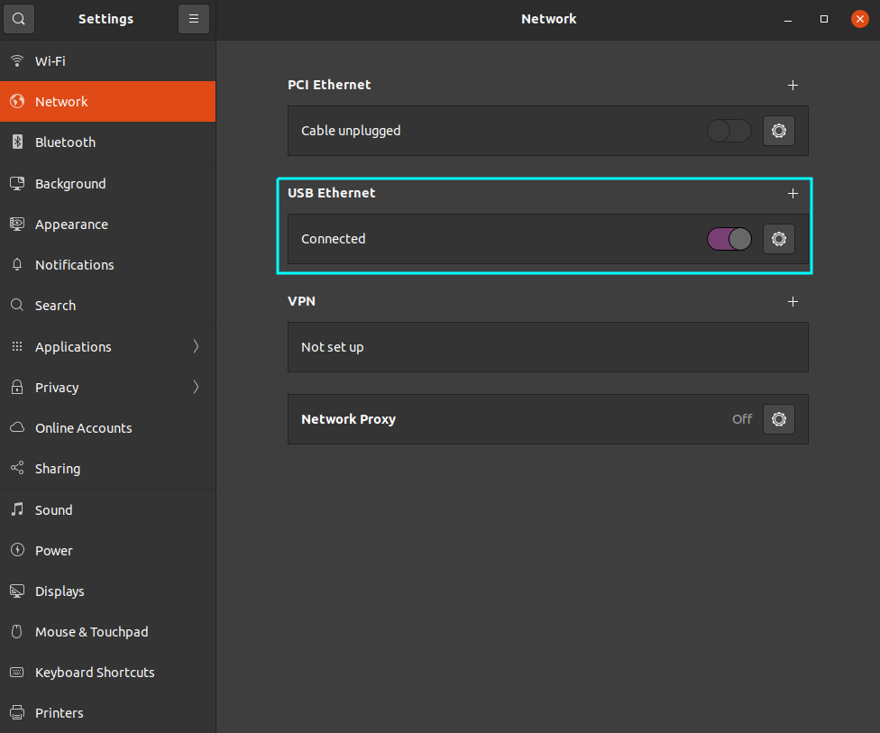
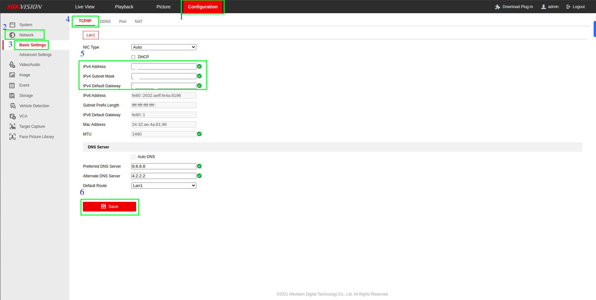

# 🌐 Network

Comprehensive guide for configuring system networking on AI hardware nodes — covering static IP setup, dual-network configuration, CCTV integration, and VPN tunneling.

---

## Configuring System Network

### CLI

**Step 1** — Open the terminal on your system.

**Step 2** — List your network interfaces:

```bash
nmcli device
```

!!! info "Interface names"
    This shows your network interface names, e.g. `enp0s3`, `wlp2s0`.
    Note yours — you will need it in the following steps.

**Step 3** — Edit the connection settings (replace `enp0s3` with your interface name):

```bash
nmcli connection edit enp0s3
```

**Step 4** — In the `nmcli` interactive prompt, set IP, subnet, gateway, and DNS:

```console
nmcli> set ipv4.method manual
nmcli> set ipv4.addresses 192.168.1.100/24
nmcli> set ipv4.gateway 192.168.1.1
nmcli> set ipv4.dns 8.8.8.8,8.8.4.4
nmcli> quit
```

!!! warning "Replace placeholder values"
    Substitute the IP address, subnet mask, gateway, and DNS with your actual network values.

**Step 5** — Activate the new configuration:

```bash
nmcli connection up enp0s3
```

**Step 6** — Verify the new IP address:

```bash
ip addr show enp0s3
```

!!! success "Expected result"
    You should see your new IP address listed under the interface output.

---

### GUI

**Step 1 — Open Settings**

- Click the system menu at the top-right corner of your screen.
- Select **Settings** from the dropdown.

<figure markdown>
  
  <figcaption>System menu → Settings</figcaption>
</figure>

**Step 2 — Navigate to Network Settings**

- In Settings, click **Network** in the left sidebar.
- Under **Wired**, click the gear icon ⚙️ next to your wired connection.

<figure markdown>
  
  <figcaption>Network section in Settings</figcaption>
</figure>

**Step 3 — Network Configuration**

- Click the **IPv4** tab.
- Change **IPv4 Method** from `Automatic (DHCP)` to `Manual`.
- Fill in the address fields:

| Field | Example Value |
|-------|--------------|
| Address | `192.168.0.101` |
| Netmask | `255.255.255.0` |
| Gateway | `192.168.0.1` |

- Click **Apply** at the top-right to save.

<figure markdown>
  
  <figcaption>IPv4 Manual configuration screen</figcaption>
</figure>

**Step 4 — Reconnect the Wired Connection**

- Ensure your Ethernet cable is plugged in.
- If it was unplugged, plug it back in — the system will now use your manual IP.

---

## Connect Two Different Networks on GPU

Dual-network setup: **USB dongle** for internet access, **LAN** for camera / CCTV access.

### CLI

**Step 1 — Identify Network Interfaces**

```bash
ip link show
```

!!! info "Note interface names"
    Record the interface names from the output, e.g. `eth0`, `eth1`, `usb0`.

**Step 2 — Configure Static IP for USB Dongle (Internet)**

```bash
sudo nano /etc/netplan/01-netcfg.yaml
```

```yaml
network:
  version: 2
  ethernets:
    usb0:
      addresses:
        - 192.168.2.10/24     # Replace with your desired IP
      gateway4: 192.168.2.1   # Replace with your gateway
      nameservers:
        addresses:
          - 8.8.8.8
          - 8.8.4.4
```

**Step 3 — Configure Static IP for LAN (Camera Access)**

```bash
sudo nano /etc/netplan/01-netcfg.yaml
```

```yaml
network:
  version: 2
  ethernets:
    eth0:
      addresses:
        - 192.168.1.10/24     # Replace with your desired IP
      gateway4: 192.168.1.1   # Replace with your gateway
      nameservers:
        addresses:
          - 8.8.8.8
          - 8.8.4.4
```

**Step 4 — Apply the Netplan Configuration**

```bash
sudo netplan apply
```

**Step 5 — Verify Connections**

```bash
ip a
```

```bash
ping -c 4 google.com
```

```bash
ping -c 4 192.168.1.20
```

---

??? tip "Troubleshooting dual-network issues"

    **Check Netplan config syntax:**
    ```bash
    sudo netplan try
    ```

    **Restart network services:**
    ```bash
    sudo systemctl restart systemd-networkd
    sudo systemctl restart NetworkManager
    ```

    **Review system logs:**
    ```bash
    sudo journalctl -u systemd-networkd
    sudo journalctl -u NetworkManager
    ```

??? example "Complete Netplan config — `/etc/netplan/01-netcfg.yaml`"

    ```yaml
    network:
      version: 2
      ethernets:
        usb0:
          addresses:
            - 192.168.2.10/24
          gateway4: 192.168.2.1
          nameservers:
            addresses:
              - 8.8.8.8
              - 8.8.4.4
        eth0:
          addresses:
            - 192.168.1.10/24
          gateway4: 192.168.1.1
          nameservers:
            addresses:
              - 8.8.8.8
              - 8.8.4.4
    ```

---

### GUI

**Step 1 — Open Network Settings**

- Click the Network icon in the system tray → **Settings**.

**Step 2 — Configure LAN (Camera Access)**

- Click ⚙️ next to your wired connection (`eth0`).

<figure markdown>
  
  <figcaption>Wired connection settings</figcaption>
</figure>

- Go to **IPv4** tab → select **Manual**.

| Field | Value |
|-------|-------|
| Address | `192.168.1.10` |
| Netmask | `255.255.255.0` |
| Gateway | `192.168.1.1` |

- DNS: `8.8.8.8, 4.2.2.2` → Click **Apply**.

<figure markdown>
  
  <figcaption>Wired IPv4 manual configuration</figcaption>
</figure>

**Step 3 — Configure USB Dongle (Internet)**

- Locate your USB Ethernet connection (`usb0`) → click ⚙️.

<figure markdown>
  
  <figcaption>USB Ethernet connection settings</figcaption>
</figure>

- Go to **IPv4** tab → select **Manual**.

| Field | Value |
|-------|-------|
| Address | `192.168.2.10` |
| Netmask | `255.255.255.0` |
| Gateway | `192.168.2.1` |

- DNS: `8.8.8.8, 4.2.2.2` → Click **Apply**.

<figure markdown>
  
  <figcaption>USB IPv4 manual configuration</figcaption>
</figure>

**Step 4 — Verify**

```bash
ping -c 4 google.com
```

```bash
ping -c 4 <camera-ip-address>
```

---

## CCTV Configuration

### 1. Ensure Network Compatibility

!!! warning "Network alignment is critical"
    The CCTV / DVR must be on the **same subnet** as the GPU node.
    If not, reconfigure the GPU network interface before proceeding.

**To reconfigure DVR IP:**

1. Open a browser → navigate to the DVR's IP address.
2. Log in with admin credentials.
3. Go to **Configuration → Network → Basic Settings**.
4. Update the IP to match your GPU node's subnet.
5. Save and apply.

<figure markdown>
  
  <figcaption>DVR Network configuration page</figcaption>
</figure>

### 2. Configure DVR Video Encoding

- Open the DVR IP in a browser and log in.
- Go to **Configuration → Video/Audio**.
- Adjust encoding settings to match your analytics pipeline requirements.

!!! note "Settings are hardware-dependent"
    Specific encoding parameters depend on your DVR model and analytics requirements.
    Consult your DVR manual for supported codecs and recommended settings.

---

## VPN

### Tunnel VPN

A Tunnel VPN creates an encrypted channel between your device and a VPN server — all traffic is protected from interception and tampering.

=== "Key Features"

    | Feature | Description |
    |---------|-------------|
    | **Encryption** | End-to-end encrypted — unreadable if intercepted |
    | **Authentication** | Only authorized users can establish a tunnel |
    | **Data Integrity** | Ensures data is not tampered with in transit |

=== "Common Use Cases"

    | Use Case | Details |
    |----------|---------|
    | Public Wi-Fi security | Encrypts traffic on untrusted networks |
    | Remote access | Access internal AI infrastructure from outside |
    | Sensitive data protection | Shields GPU telemetry and model data in transit |

### Configuring FortiClient Tunnel VPN

**Step 1 — Download and Install FortiClient**

- Visit the [Fortinet website](https://www.fortinet.com/support/product-downloads).
- Download the version for your OS (Windows / macOS / Linux).
- Run the installer and follow on-screen instructions.

**Step 2 — Configure VPN Settings**

- Launch **FortiClient** → go to **Remote Access** tab.
- Click **Configure VPN** → choose **SSL-VPN** or **IPsec VPN**.

| Field | Value |
|-------|-------|
| Connection Name | e.g. `Work VPN` |
| Remote Gateway | IP or hostname of your VPN server |
| Port | Default, or as given by your network admin |
| Username / Password | Your VPN credentials |

- Click **Save**.

**Step 3 — Connect**

- In FortiClient → **Remote Access** → select your connection → click **Connect**.
- Enter credentials and complete any 2FA steps.

!!! success "Connected"
    FortiClient will show status as **Connected**.
    You can now access remote resources as if on-site.

**Step 4 — Disconnect**

- Return to FortiClient → click **Disconnect** on the Remote Access tab.

!!! tip "Best practice"
    Disconnect VPN when not in use to avoid unnecessary bandwidth usage
    and maintain optimal GPU node network performance.